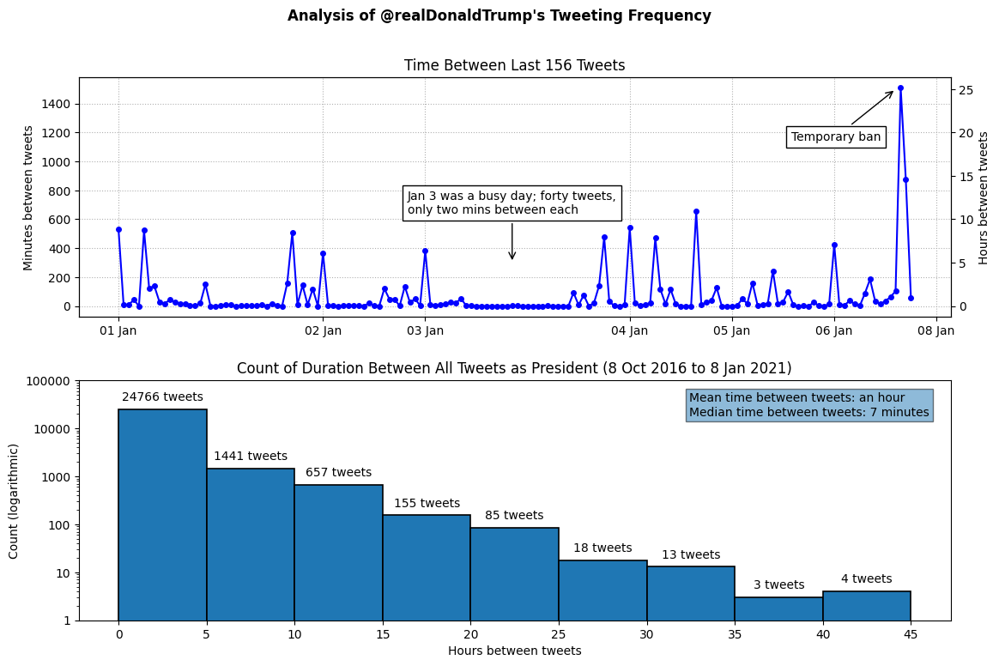

# Trump Tweets

A quick analyis of @realDonaldTrump's tweeting frequency.

```
$ python3 trumptweets.py
[+] Loaded 56571 Tweets from @realDonaldTrump
[+] Pruned 29428 Tweets for post-POTUS Tweets only
[+] Loaded 27143 Tweets from @realDonaldTrump
[+] Longest delay between tweeting (a day) after this tweet : "I am working hard, even on Thanksgiving, trying to get Carrier A.C. Company to stay in the U.S. (Indiana). MAKING PROGRESS - Will know soon!" (2016-11-24 15:11:58)
[+] Tweet after that big delay: "Fidel Castro is dead!"
[+] Mean time between tweets: an hour
[+] Median time between tweets: 7 minutes
[+] Graphs saved to 'TrumpTweets.png'
```

The median result is more interesting, because it discards the outliers. So, we can say Trump generally tweeted every 7 minutes during his presidency. Wow.

The two graphs below explore this a little more. The top one is a small sample of Trump's final 156 Tweets (Jan 1st to Jan 8th 2020). There's very little delay between Tweeets, with the biggest gap during his 12 hour ban.

The second graph is a histogram of all his Tweets during his presidency, with the buckets counting the frequency of delays between each Tweet. The scale is logarithmic, so we can see that 91% (24766) of his total tweets as president had a delay of five hoursor less between them.


